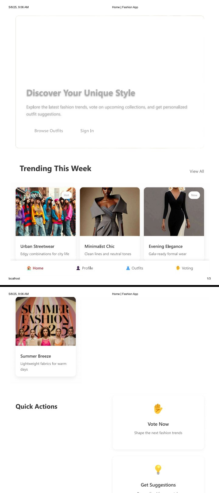
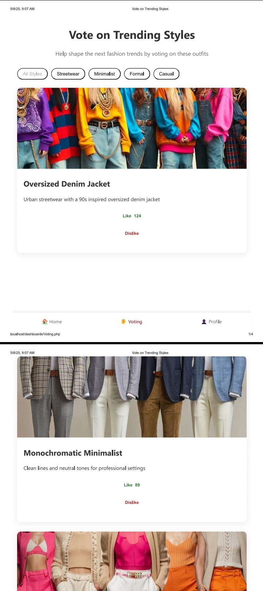
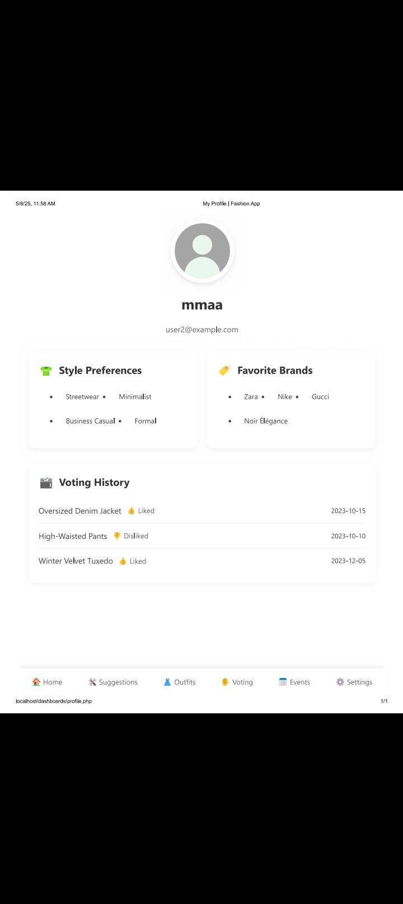
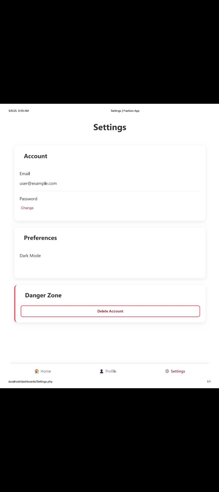

Fashion Web- README
Overview
A fashion-focused web application that allows users to:

Discover upcoming fashion events

Browse and vote on trending outfits

Get personalized style suggestions

Manage their fashion profile and preferences

Features
Core Functionality
Event Discovery: View upcoming fashion events with details like dates, locations, and descriptions

Outfit Voting: Like/dislike outfits to help shape fashion trends

Personalized Suggestions: Get outfit recommendations based on voting history

User Profiles: Track preferences, voting history, and favorite brands

Pages
Home: Overview with trending outfits and quick actions

Events: Upcoming fashion events calendar

Outfits: Browse and filter outfits by style/season

Voting: Vote on trending styles

Suggestions: Personalized outfit recommendations

Profile: User preferences and history

Settings: Account management

Technical Details
File Structure
├── assets/            # Images and static files
├── css/               # Stylesheets
│   ├── global.css     # Global styles
│   ├── auth.css       # Authentication pages
│   └── ...           # Page-specific styles
├── dashboards/        # Main application pages
│   ├── Event.php
│   ├── Outfit.php
│   ├── Profile.php
│   ├── Settings.php
│   ├── Suggestions.php
│   └── Voting.php
├── includes/          # Backend components
│   ├── auth.php       # Authentication logic
│   ├── config.php     # Configuration
│   ├── db.php         # Database connection
│   └── router.php     # Routing system
├── auth/              # Authentication pages
│   ├── login.php
│   └── signup.php
├── index.php          # Main entry point
└── index-content.php  # Home page content
Technologies Used
Frontend: HTML5, CSS3, JavaScript

Backend: PHP

Database: MySQL (via PDO)

Routing: Custom PHP router

Authentication: Session-based

Installation
Requirements
PHP 7.4+

MySQL 5.7+

Web server (Apache/Nginx)

Setup
Clone the repository:

bash
git clone https://github.com/yourusername/fashion-app.git
Configure the database:

Create a MySQL database

Import the SQL schema (if available)

Update database credentials in includes/config.php

Set up the web server:

Point your web server to the project root

Ensure URL rewriting is enabled for clean URLs

Configure base URL:

Update BASE_URL in includes/config.php

Usage
Access the application in your browser

Register a new account or login

Explore fashion events and outfits

Vote on styles to get personalized suggestions

Development
Running Locally
Start a local PHP server:

bash
php -S localhost:8000
Access the app at http://localhost:8000

Customization
Modify styles in the CSS files

Add new outfit/event data in respective PHP files

Extend functionality by modifying the router and controllers

Contributing
Contributions are welcome! Please:

Fork the repository

Create a feature branch

Submit a pull request

License
MIT License

live demo chemerebet ena demo screenshoot folder kefeche ena ene elekeleshalew screenshootochun

## Screenshots
| Home Page | Voting Interface |
|-----------|------------------|
|  |  |

| Profile | Setting|
|---------|--------|
|  |  | yehen readme ly add argew le screenshootu
